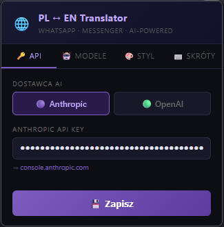
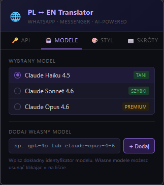
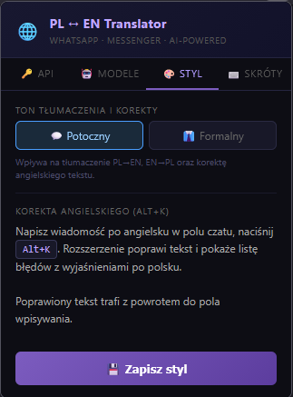
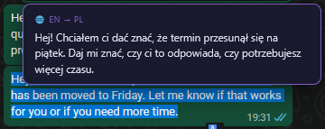
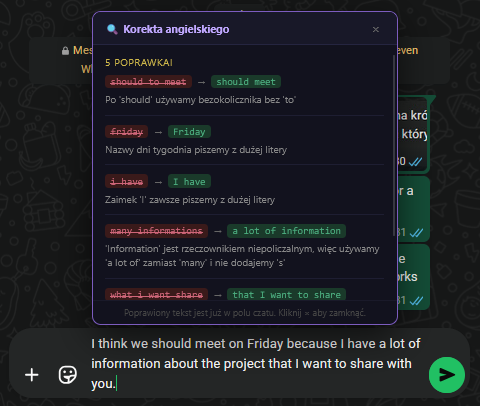

# ChatLingo — Firefox Extension

Inteligentny asystent do komunikacji w czacie, który tłumaczy wiadomości między polskim a angielskim oraz pomaga pisać poprawnie po angielsku. Działa na **WhatsApp Web** i **Messengerze**, używa modeli AI od **Anthropic** lub **OpenAI**. Do działania potrzebuje klucza API od jednego z tych dostawców.


---

## Funkcje

- **Alt+T** — tłumacz tekst w polu czatu PL → EN
- **Alt+R** — tłumacz zaznaczony tekst EN → PL (dymek nad zaznaczeniem)
- **Alt+K** — popraw angielski w polu czatu + panel błędów z wyjaśnieniami po polsku
- Obsługa **Anthropic** (Claude) i **OpenAI** (GPT) — własny klucz API
- Wybór modelu z listy lub dodanie własnego po identyfikatorze
- Ton tłumaczenia: **potoczny** lub **formalny**
- Tłumaczenie EN→PL tylko na żądanie (zaznaczenie + skrót) — zero zbędnych wywołań API

---

## Instalacja

### Z repozytorium (tryb deweloperski)

```bash
git clone https://github.com/TWOJ_USERNAME/NAZWA_REPO.git
cd NAZWA_REPO
```

1. Otwórz Firefox i wejdź na: `about:debugging#/runtime/this-firefox`
2. Kliknij **„Załaduj tymczasowy dodatek…"**
3. Przejdź do sklonowanego folderu i wybierz plik `manifest.json`
4. Ikona 🌐 pojawi się na pasku narzędzi

> ⚠️ **Tymczasowy dodatek** znika po restarcie przeglądarki.  
> Aby instalować trwale bez podpisywania przez Mozilla, użyj **Firefox Developer Edition** i ustaw `xpinstall.signatures.required = false` w `about:config`.

### Jako plik ZIP

Pobierz archiwum z zakładki [Releases](../../releases), następnie wykonaj kroki 1–4 powyżej wskazując plik `manifest.json` wewnątrz rozpakowanego archiwum.

---

## Konfiguracja

Kliknij ikonę 🌐 na pasku narzędzi — panel ustawień ma cztery zakładki.

### 🔑 API

Wybierz dostawcę i wpisz klucz:

| Dostawca | Format klucza | Gdzie pobrać |
|----------|--------------|--------------|
| Anthropic | `sk-ant-api03-...` | https://console.anthropic.com/settings/keys |
| OpenAI | `sk-proj-...` | https://platform.openai.com/api-keys |

Możesz zapisać klucze obu dostawców jednocześnie.

### 🤖 Modele

**Anthropic:** Claude Haiku 4.5 (tani ✓) · Claude Sonnet 4.6 · Claude Opus 4.6  
**OpenAI:** GPT-4o mini (tani ✓) · GPT-4o · GPT-4.1

Możesz dodać dowolny model wpisując jego dokładny identyfikator (np. `gpt-4o-2024-11-20`).

### 🎨 Styl

- **Potoczny** — naturalny, swobodny język codziennych rozmów
- **Formalny** — profesjonalny, biznesowy rejestr

Ton wpływa na tłumaczenie i korektę angielskiego.

---

## Skróty klawiszowe

| Skrót | Akcja |
|-------|-------|
| `Alt + T` | Tłumacz pole czatu PL → EN |
| `Alt + R` | Tłumacz zaznaczony tekst EN → PL |
| `Alt + K` | Popraw angielski + panel błędów |

---

## Bezpieczeństwo

- Wszystkie zapytania przez **HTTPS** (TLS 1.2/1.3)
- Klucz API w `browser.storage.local` — niedostępny dla stron internetowych
- Klucz nie jest wbudowany w kod źródłowy
- Treść tłumaczonych wiadomości trafia do serwerów Anthropic/OpenAI — obaj dostawcy nie trenują modeli na danych z API

---

## Koszty API (orientacyjnie)

| Model | Koszt / 1M tokenów wej. | Typowa wiadomość 50 słów |
|-------|------------------------|--------------------------|
| Claude Haiku 4.5 | ~$0.80 | < $0.0001 |
| GPT-4o mini | ~$0.15 | < $0.0001 |
| Claude Sonnet 4.6 | ~$3.00 | ~$0.0002 |
| GPT-4o | ~$2.50 | ~$0.0002 |

Przy kilkunastu tłumaczeniach dziennie — kilkadziesiąt groszy miesięcznie.

---

## Znane ograniczenia

- Rozszerzenie używa **Manifest V2** — w pełni obsługiwany przez Firefox, deprecated w Chrome/Chromium
- WhatsApp Web czasem zmienia strukturę DOM po aktualizacji — może wymagać korekty selektorów w `content.js`
- Testowano na Firefox 120+

---

## Struktura projektu

```
translator-extension/
├── manifest.json       # Konfiguracja rozszerzenia
├── background.js       # Wywołania API (Anthropic + OpenAI)
├── content.js          # Logika na stronach czatu
├── content.css         # Reset styli dla UI rozszerzenia
├── popup.html          # Panel ustawień
├── popup.js            # Logika panelu ustawień
└── icons/
    └── icon48.png
```

---

## Obsługiwane strony

- `https://web.whatsapp.com/`
- `https://www.messenger.com/`
- `https://www.facebook.com/messages/`

---

## Screenshots

> Wklej screenshoty do folderu `screenshots/` w repozytorium, a następnie zamień poniższe placeholdery na właściwe nazwy plików.

### Panel ustawień — zakładka API


### Panel ustawień — zakładka Modele


### Panel ustawień — zakładka Styl


### Tłumaczenie PL → EN (Alt+T)


### Tłumaczenie zaznaczonego tekstu EN → PL (Alt+R)


### Korekta angielskiego z panelem błędów (Alt+K)


---

## Licencja

[MIT](LICENSE)
